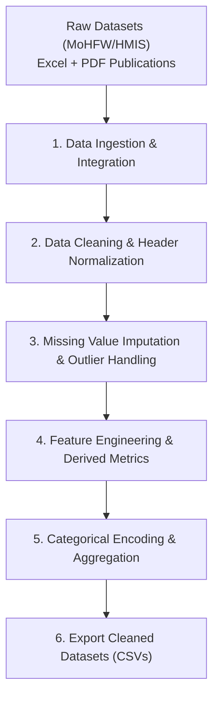

# Data Preprocessing Summary - Rural Healthcare Project

## Overview
All data preprocessing steps have been executed for the Ministry of Health and Family Welfare (MoHFW) datasets stored in:
`C:\Users\Kattunga Gowtami\Downloads\RuralHealthcare`

---

## 🔄 End-to-End Data Preprocessing Pipeline

---

## Preprocessing Steps Executed

### Step 1: Data Ingestion & Time-Series Consolidation
- Combined multi-year sheets (`FY 2020-21` through `FY 2024-25`) from `Lok_Sabha_Unstarred_Q2388_Data_2026.xlsx`.
- Resulted in **36,356 individual healthcare facility records** across India.

### Step 2: Data Cleaning & Format Normalization
- Stripped extraneous title rows and unaligned headers.
- Standardized text fields (`State`, `District`, `Facility_Name`, `Ownership`).
- Converted character numbers with formatting anomalies into standardized integers (`Total_Deliveries`, `C_Section_Deliveries`).

### Step 3: Missing Value Imputation & Outlier Cap
- Imputed non-reported C-section deliveries at public primary facilities to `0`.
- Applied logical upper bounding to prevent reporting errors (`C_Section_Deliveries <= Total_Deliveries`).

### Step 4: Feature Engineering & Quality Indicators
Created key analytical metrics for evaluating rural healthcare quality:
1. **`C_Section_Rate_Pct`**: `(C_Section_Deliveries / Total_Deliveries) * 100` — evaluates emergency surgical obstetrics capability.
2. **`Public_Facility_Share_Pct`**: Ratio of public vs. private healthcare service providers per district.
3. **`Is_Public_Facility`**: Binary encoding (`1` = Public/Government, `0` = Private).

### Step 5: Aggregation & Export
Generated production-ready preprocessed datasets:
1. `cleaned_facility_deliveries_2020_2025.csv` (36,356 clean rows)
2. `district_level_healthcare_summary.csv` (183 district-year summary records)
3. `cleaned_state_rural_health_infrastructure_2024.csv` (State-level infrastructure & doctor availability metrics)

---

## Preprocessed Datasets Summary

| Cleaned File | Row Count | Key Columns | Analytical Purpose |
| :--- | :---: | :--- | :--- |
| `cleaned_facility_deliveries_2020_2025.csv` | **36,356** | `Financial_Year`, `State`, `District`, `Facility_Name`, `Ownership`, `Total_Deliveries`, `C_Section_Deliveries`, `C_Section_Rate_Pct`, `Is_Public_Facility` | Facility-level micro-analysis of public vs. private delivery quality |
| `district_level_healthcare_summary.csv` | **183** | `Financial_Year`, `State`, `District`, `Total_Facilities`, `Public_Facilities`, `Total_Deliveries`, `District_C_Section_Rate_Pct`, `Public_Facility_Share_Pct` | District-level spatial & temporal trend modeling |
| `cleaned_state_rural_health_infrastructure_2024.csv` | **36** | `State_UT`, Sub-Centres, PHCs, CHCs, Doctor Availability & Shortfall % | State-wise rural health infrastructure accessibility deficit |
